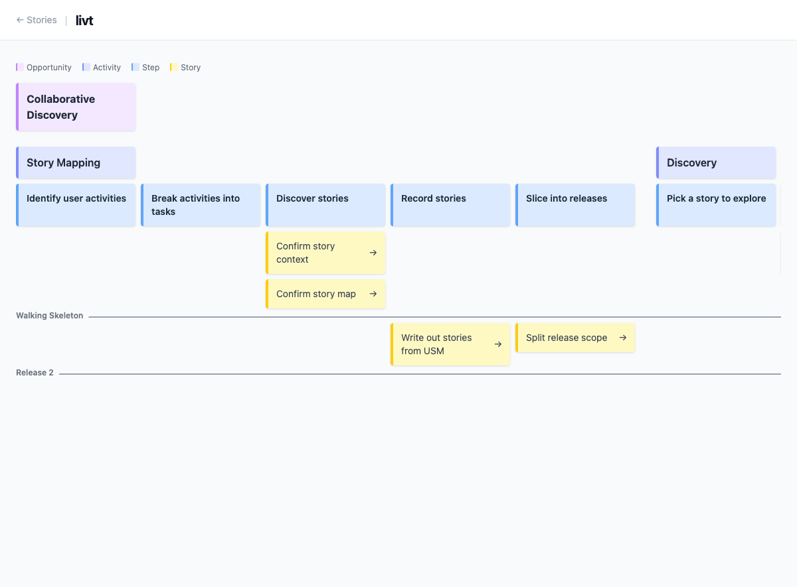

<h1 align="center">livt</h1>

<p align="center">
  <b>Collaborate on board. Make it living in text.</b>
</p>

<p align="center">
  <a href="https://boykush.github.io/livt/">Documentation</a> |
  <a href="https://boykush.github.io/livt/getting-started.html">Getting Started</a> |
  <a href="https://boykush.github.io/livt/guides/stories.html">Guides</a> |
  <a href="https://boykush.github.io/livt/reference/commands.html">Commands</a>
</p>

## What is livt?

livt is a CLI tool that captures collaborative discovery outcomes as living text. It bridges the gap between synchronous discovery sessions (like [User Story Mapping](https://boykush.github.io/livt/guides/story-maps.html) and [Example Mapping](https://boykush.github.io/livt/guides/example-mappings.html)) and development artifacts.

Discovery outcomes are written as plain text files (YAML, Markdown) and visualized as boards:



## Features

- **Stories as Markdown** -- Write stories with YAML frontmatter, keep them alongside your code
- **Story Maps** -- Visualize activities, steps, and stories with release slices on a board
- **Example Mappings** -- Render rules, examples, and questions as color-coded sticky notes
- **Static HTML output** -- `livt build` generates a standalone site, no runtime required
- **Local dev server** -- `livt serve` builds and serves with one command

## Installation

```bash
go install github.com/boykush/livt@latest
```

## Quick Start

```bash
# Create the directory structure
mkdir -p stories discoveries/usm discoveries/example-mappings

# Create your first story
cat <<'EOF' > stories/my-first-story.md
---
name: My first story
---

As a user
I want to do something
So that I get value
EOF

# Build and serve
livt serve
```

Open http://localhost:3000 in your browser.

See the [Getting Started guide](https://boykush.github.io/livt/getting-started.html) for more details.

## File Structure

```
stories/
  {story-key}.md                     # Story files
discoveries/
  usm/
    {map-name}.yaml                  # Story map files
  example-mappings/
    {story-key}.yaml                 # Example mapping files
```

See [File Structure reference](https://boykush.github.io/livt/reference/file-structure.html) for output details.

## License

MIT
