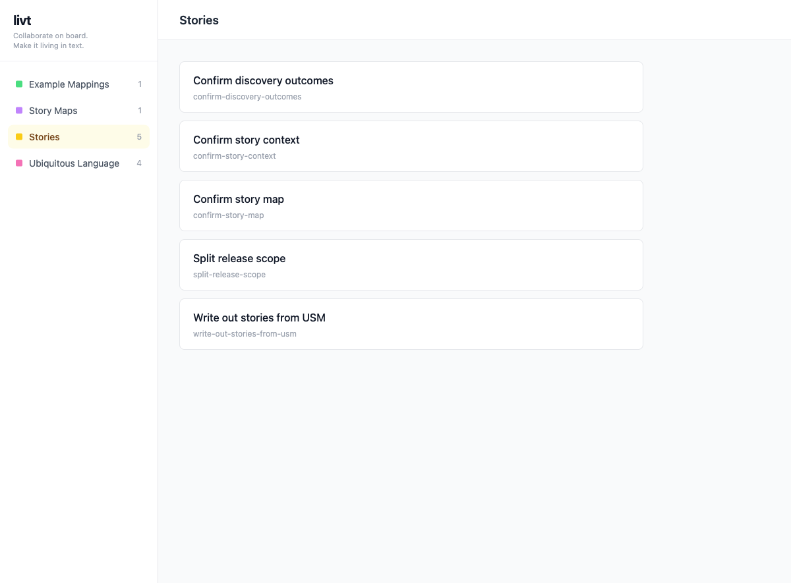

# Getting Started

## Installation

Install with [mise](https://mise.jdx.dev/), which verifies the release binary's build provenance attestation by default:

```bash
mise use "github:boykush/livt@<version>"
```

See [Installation](installation.md) for all methods and how release artifacts are verified.

## Quick Start

1. Create the required directories:

```bash
mkdir -p stories discoveries/usm discoveries/example-mappings ubiquitous
```

2. Create your first story in `stories/my-first-story.md`:

```markdown
---
name: My first story
---

As a user
I want to do something
So that I get value
```

3. Build and serve:

```bash
livt serve
```

4. Open <http://localhost:3000> in your browser. Every page has a sidebar to
   switch between Example Mappings, Story Maps, Stories, and Ubiquitous Language.
   Open **Stories** to find the story you just created:


