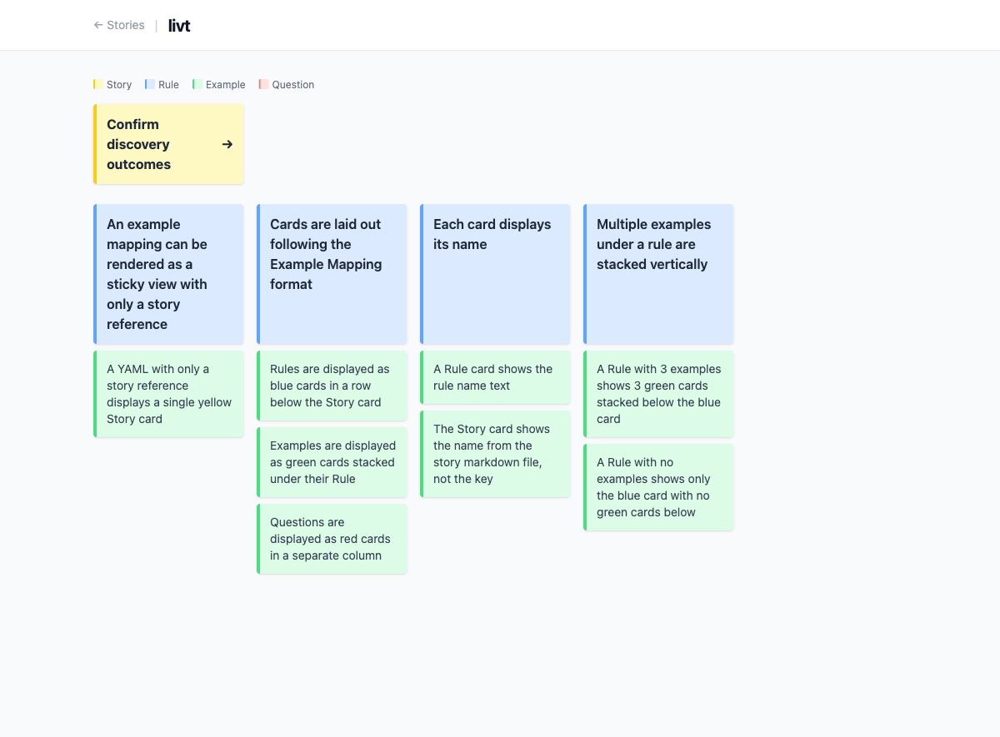

# Example Mappings

Example mappings are YAML files stored in `discoveries/example-mappings/`. They capture the rules, examples, and questions discovered during an Example Mapping session for a story.

## Format

```yaml
story: story-key

rules:
  - id: R-01
    name: Rule description
    examples:
      - id: EX-01
        name: Example description

questions:
  - id: Q-01
    text: Question text
```

- `story` is optional (links to the corresponding story detail page)
- IDs must be unique within their rule or question list

## Visual Layout

The board renders cards in the [Example Mapping](https://cucumber.io/blog/bdd/example-mapping-introduction/) format:

- **Yellow** card: Story (top)
- **Blue** cards: Rules (row below story)
- **Green** cards: Examples (stacked under their rule)
- **Red** cards: Questions (separate column)

## Example

`discoveries/example-mappings/confirm-discovery-outcomes.yaml`:

```yaml
rules:
  - id: R-01
    name: An example mapping can be rendered as a sticky view with only a story reference
    examples:
      - id: EX-01
        name: A YAML with only a story reference displays a single yellow Story card

  - id: R-02
    name: Cards are laid out following the Example Mapping format
    examples:
      - id: EX-01
        name: Rules are displayed as blue cards in a row below the Story card
      - id: EX-02
        name: Examples are displayed as green cards stacked under their Rule
      - id: EX-03
        name: Questions are displayed as red cards in a separate column

questions: []
```


