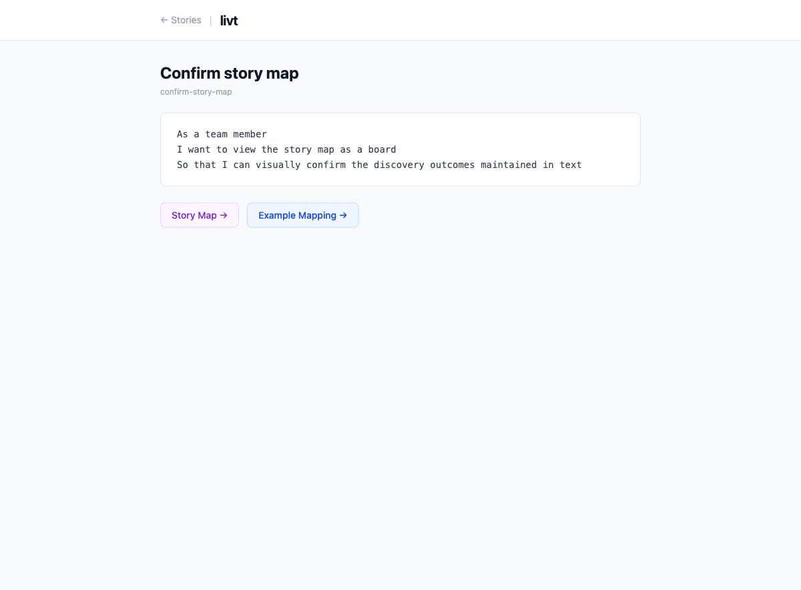

# Stories

Stories are Markdown files with YAML frontmatter, stored in the `stories/` directory.

## Format

```markdown
---
name: Story display name
---

Story body in Markdown.
```

The `name` field in frontmatter is required. The **story key** is derived from the filename (without `.md`).

## Example

`stories/confirm-story-map.md`:

```markdown
---
name: Confirm story map
---

As a team member
I want to view the story map as a board
So that I can visually confirm the discovery outcomes maintained in text
```

This story has key `confirm-story-map`, which is used to reference it from story maps and example mappings.


