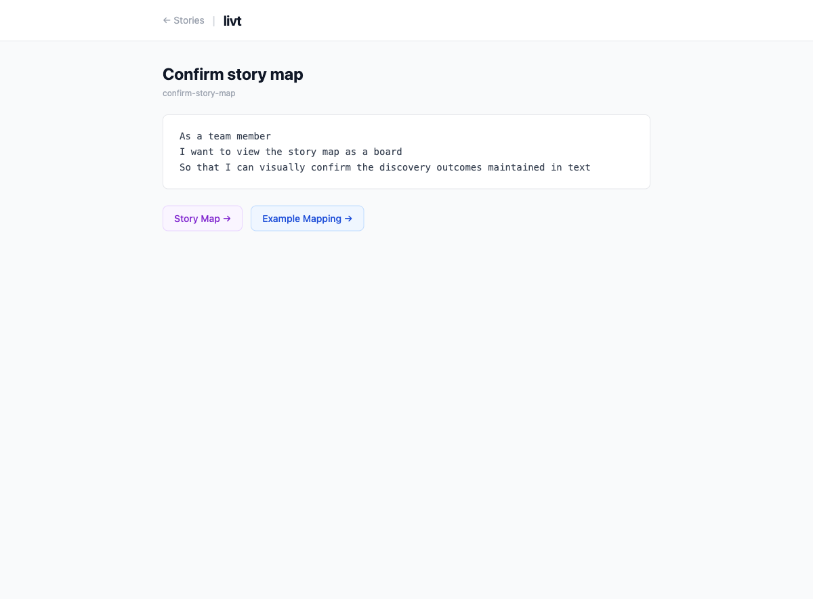

# Stories

Stories are Markdown files with YAML frontmatter, stored in the `stories/` directory.
The `stories/` directory is the story registry: once a story candidate's card is written for detailed discovery, its key is owned by `stories/{story-key}.md`.

## Format

```markdown
---
name: Story display name
---

Story body in Markdown.
```

The `name` field in frontmatter is required. The **story key** is derived from the filename (without `.md`).
Story keys must be kebab-case, using lowercase letters, numbers, and hyphens.
Key uniqueness is enforced by the filesystem: two stories cannot use the same `stories/{story-key}.md` path.

## Example

`stories/confirm-story-map.md`:

```markdown
---
name: Confirm story map
---

As a team member
I want to view the story map as a board
So that I can visually confirm the discovery outcomes maintained in text
```

This story has key `confirm-story-map`, which is used to reference it from story maps and example mappings.

## Writing the card from a story map

A story's file is its card — the Card of the three Cs, written when a candidate on a story map is
picked for its own Example Mapping. Writing it is handled by the `/write-story-card` skill (from the
`livt-discovery` plugin), rather than a CLI command. Given the story map and the candidate, it creates
`stories/{story-key}.md` first and then writes the same `key` back to the matching candidate in the
story map.


