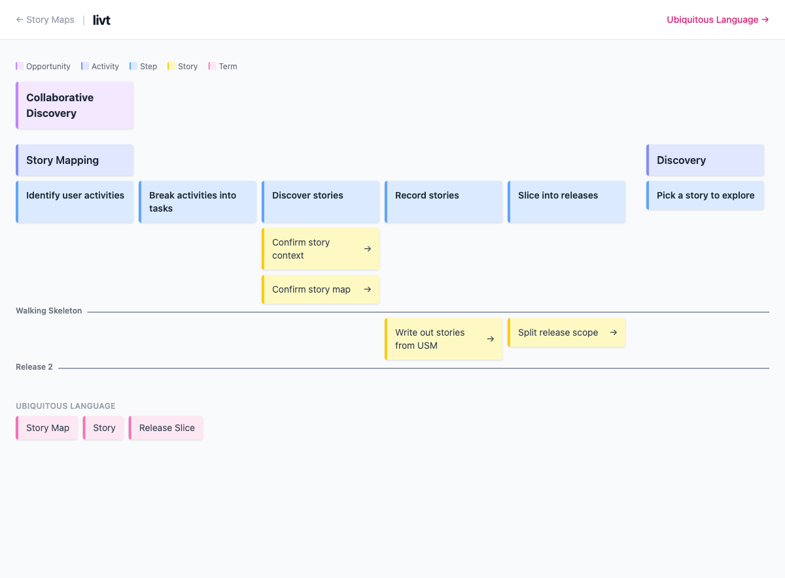

# Story Maps

Story maps are YAML files stored in `discoveries/usm/`. They define the structure of a User Story Map with activities, steps, stories, and release slices.

A map's **filename** names the [opportunity](./opportunities.md) it serves: a map whose key matches an `opportunities/{key}.md` is the journey mapped for that opportunity, and every story on it carries that opportunity's chip. A map whose key matches no opportunity stands in as its own, named by the map — see [Linking a story map](./opportunities.md#linking-a-story-map). The map's `name:` stays its own display name either way, and is what addresses it.

## Format

```yaml
name: Map Name

activities:
  - key: activity-key
    name: Activity Name
    steps:
      - key: step-key
        name: Step Name
        stories:
          - key: story-key
            name: Story Card Name
            release: release-id
          - name: Lightweight Story Card

releases:
  - id: release-id
    name: Release Name

ubiquitous:
  - term-key
```

## Ubiquitous Language

- `ubiquitous` is optional: each entry is a [ubiquitous language](./ubiquitous-language.md) term key
- Referenced terms render as pink stickies below the board, linking to `ubiquitous.html#{term-key}`
- A key with no matching term file renders as a plain pink card

## Releases

- Each release defines a horizontal divider on the board
- Each release has an `id` that story cards reference with `release`
- Stories with a `release` appear above that release's divider
- A release without `name` defaults to "Release N" based on position
- Stories not in any release appear below all dividers
- Story cards without `key` appear as plain cards and can still belong to a release
- A story can reference only one release

## Example

`discoveries/usm/collaborative-discovery.yaml`:

```yaml
name: Collaborative Discovery

activities:
  - key: story-mapping
    name: Story Mapping
    steps:
      - key: discover-stories
        name: Discover stories
        stories:
          - key: confirm-story-context
            name: Confirm story context
            release: walking-skeleton
          - key: confirm-story-map
            name: Confirm story map
            release: walking-skeleton
          - name: Draft session outcomes
      - key: slice-releases
        name: Slice into releases
        stories:
          - key: split-release-scope
            name: Split release scope
            release: release-2

  - key: discovery
    name: Discovery
    steps:
      - key: discover-rules
        name: Discover rules
        stories:
          - key: confirm-discovery-outcomes
            name: Confirm discovery outcomes
            release: walking-skeleton

releases:
  - id: walking-skeleton
    name: Walking Skeleton
  - id: release-2
```


